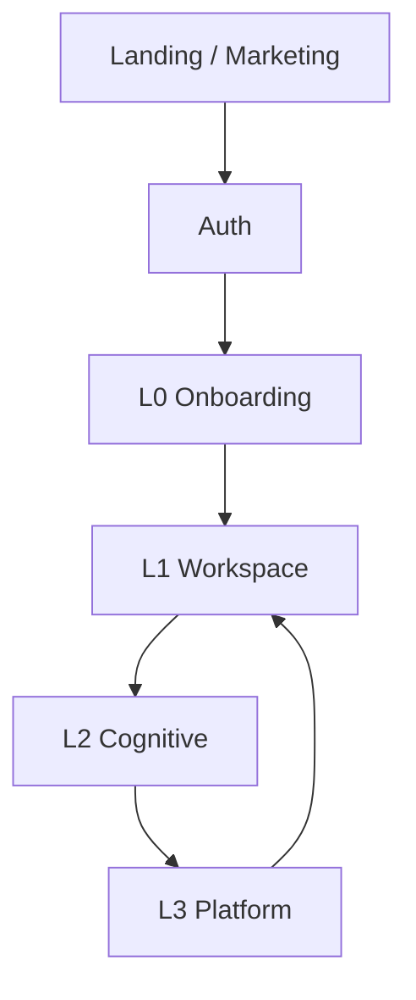
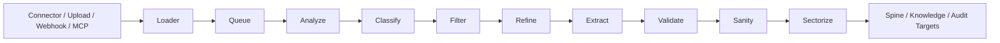
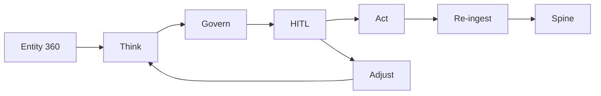

# IntegrateWise — Final Technical Architecture

**Status:** Canonical architecture draft based on KT v1.2
**Classification:** Internal
**Canonical Product Statement:** IntegrateWise is a Knowledge Workspace over the Spine, empowered by AI and governed by approvals.

---

## 1. Executive Summary

IntegrateWise is designed as a **Knowledge Workspace over the Spine**.

The product works because four things are kept separate but connected:

1. **L0 Onboarding** establishes tenant identity, domain context, and schema direction.
2. **L1 Workspace** is the operating surface where users work.
3. **L2 Cognitive** is the intelligence layer that reasons over truth, proposes actions, and waits for approval.
4. **L3 Platform** is the controlled backend path where all external data is ingested, normalized, stored, and re-ingested.

The architecture is governed by one rule:

> **All durable business value in IntegrateWise must be created through a Spine-based flow.**

This means data must follow the canonical loop:

**Ingest → Normalize → Store → Render → Think → Govern / HITL → Act → Re-ingest**

---

## 2. Canonical Framing

### 2.1 Product framing

Use for positioning and product understanding:

* **Knowledge Workspace** — the human-facing operating environment
* **Spine** — the structured source of truth and context foundation
* **Memory / Knowledge / Compounding Space** — approved contextual memory and linked evidence
* **AI** — reasoning, signals, proposals, and governed execution support
* **Approvals** — human control layer for execution

### 2.2 Runtime framing

Use for implementation and system design:

* **L0** — Onboarding
* **L1** — Workspace
* **L2** — Cognitive
* **L3** — Platform / Backend

### 2.3 Bridge statement

The product components are realized through the runtime architecture:

**Landing → Auth → L0 Onboarding → L1 Workspace → L2 Cognitive → L3 Platform**

---

## 3. Architectural Principles

### 3.1 Spine is the only truth boundary

The Spine is the system of record for canonical structured truth. No connector, module, or AI path may create shadow truth outside it.

### 3.2 No external data bypasses L3

All data from connectors, uploads, documents, webhooks, MCP, and AI sessions must pass through the controlled backend path before it becomes usable platform value.

### 3.3 Workspace never loads connectors directly

L1 does not read raw connector APIs directly. It renders BFF and Spine-backed runtime projections.

### 3.4 Flow C never writes directly to Spine truth

AI and MCP flows contribute knowledge and decision support, but truth only changes through approved action followed by re-ingestion.

### 3.5 No action without approval when policy requires it

Govern and HITL are hard gates in the action loop.

### 3.6 Re-ingestion is mandatory

The result of action execution must return through the platform so the Spine stays current.

---

## 4. High-Level Architecture

### Runtime order

**Experience → Gateway → Workspace Runtime → External Connectivity → Data Plane → SSOT / Spine → Cognitive → AI Providers**

### Layer roles

#### L0 — Onboarding

Responsible for:

* tenant identity
* industry selection
* department selection
* connector relevance
* initial schema direction
* workspace activation

#### L1 — Workspace

Responsible for:

* shell and navigation
* modules and dashboards
* approvals and alerts
* entity views
* operational work surfaces

#### L2 — Cognitive

Responsible for:

* Entity 360
* signals
* Think / Govern / HITL / Act / Adjust
* evidence and audit context
* Twin / reasoning surfaces

#### L3 — Platform

Responsible for:

* gateway routing
* connector ingress
* loader and queues
* 8-stage pipeline
* Spine persistence
* Knowledge storage
* workflow / BFF projections
* re-ingestion and background processing

---

## 5. L0 Onboarding Architecture

L0 is not a UI form sequence only. It is the activation gate for the entire runtime.

### L0 outputs

Onboarding seeds:

* tenant identity
* department base schema family
* industry override profile
* initial workspace config
* connector relevance and expected entity model
* readiness for creamy hydration

### Key rule

> **Department choice selects the base schema family. Industry modifies it through additive overrides.**

---

## 6. Department and Industry Activation Model

## 6.1 Department activation

Department selection defines:

* allowed entity types
* priority fields
* organic capability mapping for the UI
* workspace emphasis
* cognitive relevance

### Active department configs

* CUSTOMER_SUCCESS
* REVOPS
* SALES
* MARKETING
* PRODUCT_ENGINEERING
* FINANCE
* SERVICE
* PROCUREMENT
* IT_ADMIN
* STUDENT_TEACHER
* BIZOPS
* PERSONAL

### Alias resolution layer

Some tenant-facing departments resolve to shared base configs, for example:

* SUPPORT → SERVICE
* ENGINEERING → PRODUCT_ENGINEERING
* PRODUCT → PRODUCT_ENGINEERING
* LEGAL → BIZOPS
* HR → BIZOPS
* SUPPLY_CHAIN → PROCUREMENT
* SERVICE_OPS → SERVICE

## 6.2 Industry override model

Industries are additive override profiles, not standalone workspace families.

### Active industry profiles

* SAAS_TECH
* PROFESSIONAL_SERVICES
* HEALTHCARE
* EDUCATION
* MANUFACTURING
* AUTOMOTIVE
* RETAIL_COMMERCE
* FINANCIAL_SERVICES
* LOGISTICS
* MEDIA
* PUBLIC_SECTOR

### Industry effect

Industry can:

* add `entity_types_extra`
* override `priority_fields`
* specialize extraction and normalization behavior
* make the same department behave differently across business contexts

---

## 7. Connector and Ingestion Architecture

Connectors are the external integration boundary.

### Connector responsibilities

* authenticate external systems
* bind installations to tenant
* start phased sync
* deliver source records into the data plane
* accept write-back instructions from Act

### Sync phases

#### Creamy

* first useful slice of truth
* enough to make L1 usable quickly

#### Needed

* next meaningful expansion of business truth

#### Delta

* ongoing freshness and incremental update path

### Connector rule

Connectors are not truth stores. They are ingest and execution surfaces.

---

## 8. Data Plane and 8-Stage Pipeline

All meaningful external data must pass through the canonical pipeline.

### Pipeline stages

1. **Analyze** — inspect incoming shape
2. **Classify** — determine entity / flow / context
3. **Filter** — apply schema and tenant rules
4. **Refine** — normalize field structure and values
5. **Extract** — pull canonical fields and relationships
6. **Validate** — type, required-field, and format checks
7. **Sanity** — anomaly and business-integrity checks
8. **Sectorize** — route the record to the correct destination

### Pipeline rule

No direct source payload becomes truth without completing this path.

---

## 9. Flow A / Flow B / Flow C Architecture

## 9.1 Flow A — Structured operational truth

Used for CRM, support, finance, project, analytics, and similar structured systems.

**Path:**
Connector → Loader → Queue → 8-stage pipeline → Spine → Workspace / Entity 360 / Signals

**Purpose:**

* create canonical structured truth
* power operational views and entity state
* support downstream reasoning and action

## 9.2 Flow B — Unstructured context and evidence

Used for emails, docs, transcripts, files, chats, and related content.

**Path:**
Ingest → Extraction / chunking / embeddings → entity linking → Knowledge + Spine references → Entity 360

**Purpose:**

* enrich context
* support evidence-backed reasoning
* preserve linked unstructured content

**Rule:**
Flow B enriches truth but does not overwrite canonical structured business truth.

## 9.3 Flow C — AI / MCP / knowledge-first flow

Used for AI sessions, MCP sessions, external AI content, and governed memory.

**Path:**
Capture → triage → approved knowledge / decision support → optional Entity 360 read-time use → approved action → re-ingestion → Spine

**Rule:**
Flow C never writes directly to Spine truth.

---

## 10. Spine Architecture

The Spine is the canonical truth layer of the platform.

### Spine responsibilities

* store canonical entities
* store relationships
* store schema observations and registry updates
* maintain tenant-partitioned structured truth
* provide stable read models for workspace and cognitive systems

### Spine rule

If truth is not written to the Spine through the pipeline, it is not part of the official system state.

---

## 11. Workspace Layer Architecture (L1)

L1 is the operating environment.

### L1 responsibilities

* render the workspace shell
* present dashboards and modules
* show signals, banners, approvals, and feeds
* provide the primary daily work surface

### L1 loading rule

> **The Workspace Layer does not load from connectors directly; it loads from Spine-backed runtime projections after Creamy hydration has passed through connector auth, loader, pipeline, normalizer, and canonical Spine write.**

### L1 loading phases

#### Phase 1 — Shell ready

* auth resolved
* tenant context loaded
* nav and readiness available

#### Phase 2 — Creamy workspace ready

* first useful records available
* dashboard and first modules become usable

#### Phase 3 — Module hydration

* module-specific views fill from Spine-backed projections

#### Phase 4 — Needed expansion

* deeper historical and broader entity coverage appears

#### Phase 5 — Delta freshness

* incremental sync keeps workspace current

### L1 loading surfaces

1. **Workspace shell load**
2. **Home dashboard load**
3. **Module data load**
4. **Intelligence overlays back into L1**

---

## 12. Entity 360 Architecture

Entity 360 is the fused read model used by the workspace and cognitive layers.

### Entity 360 combines

* Spine truth
* Knowledge context
* Signals
* optional approved memory / compounding knowledge when enabled

### Entity 360 rule

Entity 360 is a read model only. It is not a truth store and not a write surface.

---

## 13. Cognitive Architecture (L2)

L2 is the full cognitive layer, not just an insights drawer.

### L2 components

* Context
* IQ Hub
* Evidence
* Signals
* Think
* Govern
* HITL
* Act
* Adjust
* Audit / Evidence
* Twin / Agent surfaces

### Cognitive loop

### L2 rule

L2 only produces trustworthy value when it reasons over canonical Spine-backed truth and linked evidence.

---

## 14. Approval and Action Architecture

Governance is native to the architecture.

### Action path

1. Think creates proposal
2. Govern checks policy
3. HITL captures approval when required
4. Act executes approved mutation externally
5. Result is re-ingested through the platform
6. Spine truth is updated
7. Workspace reflects reconciled state

### Approval rule

No governed action is complete until the result is reconciled through re-ingestion.

---

## 15. Re-ingestion Architecture

Re-ingestion closes the loop.

### Why it exists

* prevents internal truth drift
* ensures external action outcomes become canonical truth
* allows signals and reasoning to operate on post-action reality

### Rule

Outbound execution does not directly become truth. The result must return through the controlled data path.

---

## 16. Real-Time Architecture

The workspace should reflect truth and signal changes in near real time.

### Real-time responsibilities

* BFF broadcast after meaningful Spine-backed updates
* push updated readiness / dashboard / signal state into L1
* make approval and signal changes visible without forcing full refresh

### Real-time rule

Realtime is a projection and notification layer, not a source of truth.

---

## 17. Storage Responsibility Model

### Spine

Canonical structured truth

### Knowledge

Chunks, embeddings, unstructured evidence, linked context

### Approved memory / compounding space

Governed contextual memory, not SSOT

### Audit / decisions / actions

Approval history, action records, decision traces

### Object storage

Raw artifacts and uploaded files

### Queue / state stores

Cursors, idempotency, background state, operational mechanics

---

## 18. Anti-Patterns to Avoid

1. Direct source-to-truth writes
2. Workspace reading connector APIs directly
3. AI writing directly to Spine truth
4. Entity 360 as a hidden write surface
5. Shadow schemas outside the Spine
6. Approval bypass for governed actions
7. Treating Knowledge or approved memory as the primary truth layer

---

## 19. Final Architecture Summary

The final technical architecture of IntegrateWise is:

* **L0 Onboarding** determines tenant, department, industry, and schema direction
* **Department** selects the base schema family
* **Industry** modifies that family with additive overrides
* **Connectors** ingest and execute but do not define truth
* **L3 Platform** is the mandatory entry path for all data
* **8-stage pipeline** is the normalization contract
* **Spine** stores canonical truth
* **L1 Workspace** renders Spine-backed runtime projections
* **Entity 360** fuses truth, context, and signals as a read model
* **L2 Cognitive** reasons over Entity 360 and governs action
* **Act** executes only after policy and approval conditions are satisfied
* **Re-ingestion** updates the Spine so the loop stays truthful

### Final one-line statement

**IntegrateWise architecture is a Spine-based, approval-governed, workspace-first system where all external data enters through L3, becomes canonical truth in the Spine, surfaces through L1 and L2 as runtime projections and reasoning, and returns through re-ingestion after action so truth remains consistent.**
